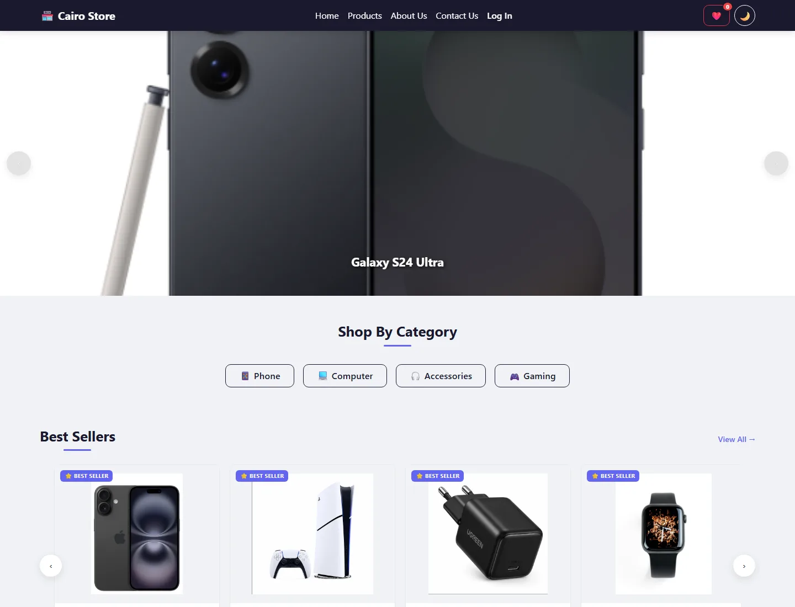
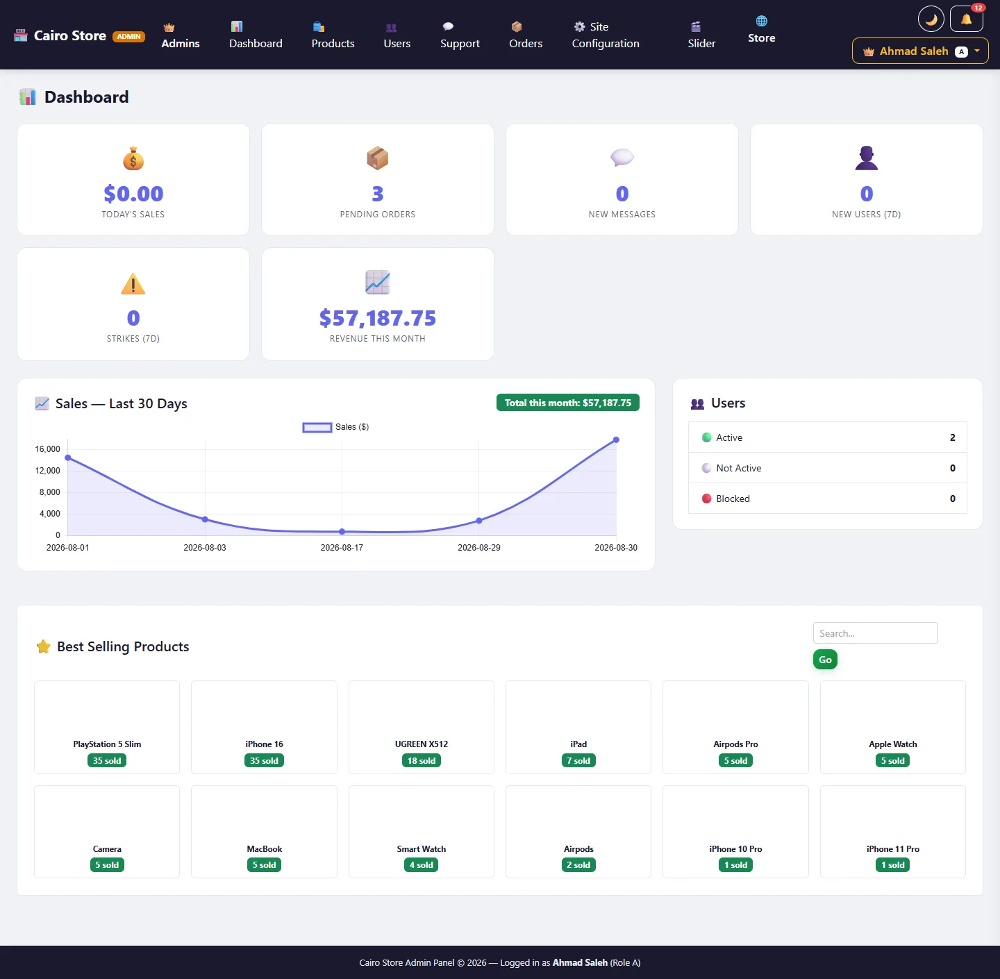
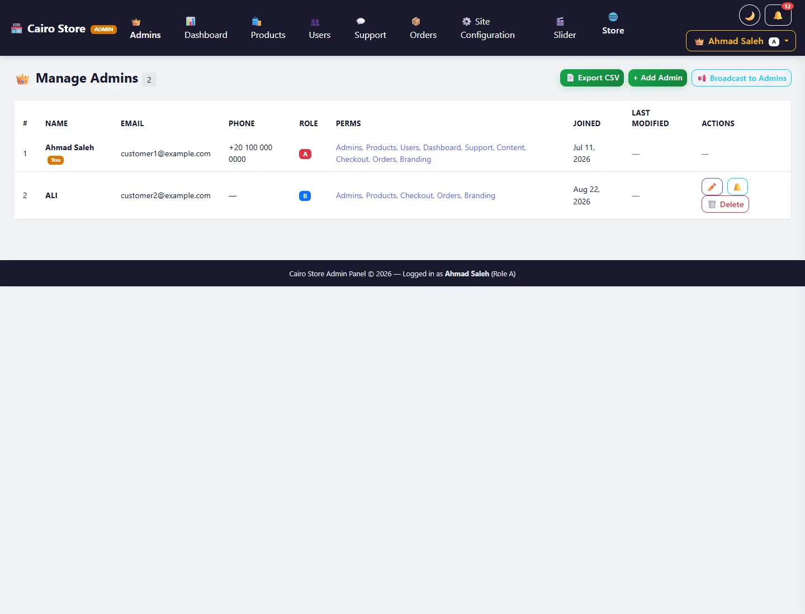
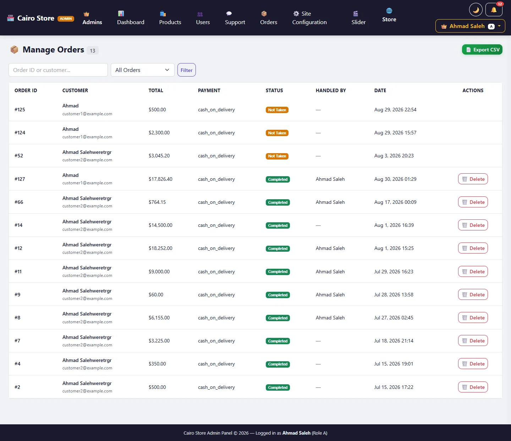
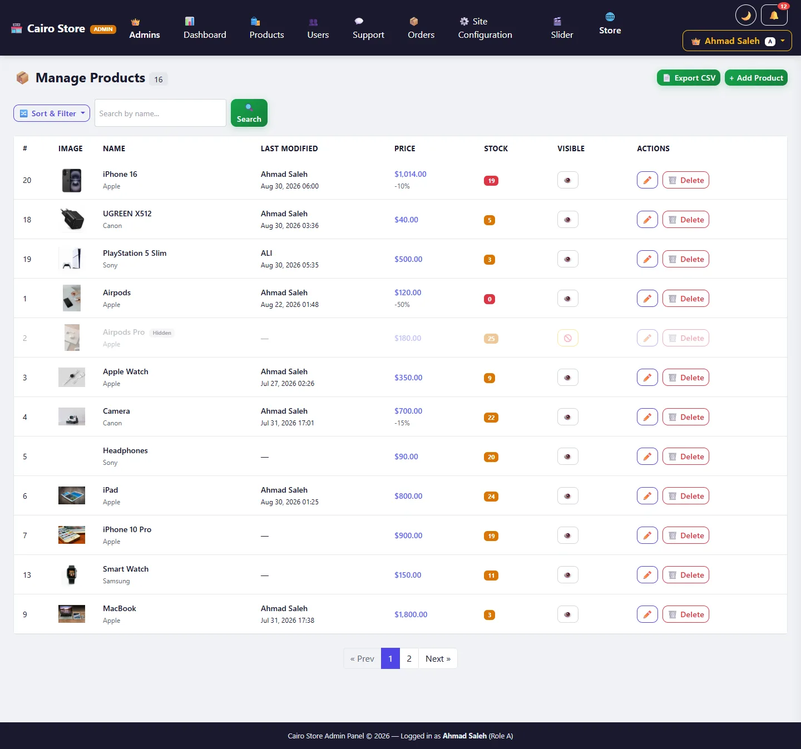

# Cairo Store

**[Open the live store →](https://cairo-store.onrender.com)**

An e-commerce store in PHP on a hand-written MVC structure with no framework — <!--stats:controllers-->25 controllers<!--/stats:controllers-->, <!--stats:models-->17 models<!--/stats:models--> and <!--stats:routes-->109 routes<!--/stats:routes-->, with a full control panel built on ranks and permissions.

> The live copy runs the image built from this repository, against a MySQL database seeded
> from `database/demo-seed.sql`. It is hosted on a free tier that sleeps after fifteen
> minutes of inactivity, so the **first request after a quiet spell takes about a minute** —
> after that it is immediate. Anything uploaded through the control panel is lost on the
> next deploy: that tier has no persistent disk, and the sixteen catalogue images are served
> from the repository rather than from uploads.

| | |
|---|---|
| **Live** | [cairo-store.onrender.com](https://cairo-store.onrender.com) · [`/health`](https://cairo-store.onrender.com/health) answers only if the database really responds |
| **PHP** | 8.2+ |
| **Database** | MySQL 8 · <!--stats:tables-->32 tables<!--/stats:tables--> |
| **Size** | <!--stats:php-->27,274 lines of PHP<!--/stats:php--> · <!--stats:js-->7,274 JS<!--/stats:js--> · <!--stats:css-->5,583 CSS<!--/stats:css--> |
| **Tests** | <!--stats:tests-->292 tests<!--/stats:tests--> (unit + integration + browser) |
| **API documentation** | OpenAPI 3.0 — <!--stats:operations-->109 operations<!--/stats:operations-->, generated from the code |

---

## Screenshots

### The storefront

| Home | Catalogue |
|---|---|
|  |  |

| Product page | Dark mode |
|---|---|
|  |  |

### The control panel

Ranks and permissions are the part worth looking at: every admin holds a role (**A** to **D**) and a row of individual permissions, and the panel hides what a rank cannot reach rather than merely refusing it on submit.

| Dashboard | Admins, ranks and permissions |
|---|---|
|  |  |

| Orders | Products |
|---|---|
|  |  |

### On a phone

| Home | Catalogue |
|---|---|
|  |  |

> The e-mail addresses and phone numbers in the control-panel images are placeholders, substituted before the screenshot was taken. The data behind them is real, so it is not shown.

---

## What makes this repository worth a look

**The comments explain "why", not "what".** Every non-obvious decision is written down with its reason, in place: why `SameSite=Lax` rather than `Strict`, why `require` rather than `require_once`, why a `csrf_invalid` code rather than the message's text. The decisions were taken by measurement rather than estimation, and the numbers are in the comment itself.

**Every fix is a test that failed first.** The repository's faults are not described in prose — they are encoded as tests that fire against the broken version and fall silent against the fixed one. `AdminProductModel::delete` returned `true` for a product that never existed and wrote a lying audit row; `Router` treated a dot as a regex metacharacter, so `/handlers/notify_handler.php` was also reachable as `/handlers/notify_handlerXphp`; `env()` let an empty key bypass its default, so `APP_ENV=` opened debug mode on a production server. Each of those has a test beside it now.

**Security is enforced automatically, not by personal discipline.** gitleaks, semgrep and trivy run locally in the git hooks and in CI alike — so the protection does not rest on somebody remembering to run it. And four of the local semgrep rules encode faults that occurred *in this project* and were never caught by a general rule.

---

## Running it with Docker (the fastest way)

```bash
docker compose up -d
docker compose exec app php scripts/migrate.php baseline
```

Then open `http://localhost:8080`. No XAMPP, no particular path and no database built by hand — the schema is loaded automatically on the first run.

To check that everything is alive:

```bash
curl http://localhost:8080/health
```

> `/health` runs a real query against the database rather than returning a fixed reply — because a container answering 200 with its database down is not healthy. It is also what `HEALTHCHECK` uses inside the image.

To fill the store with the demo catalogue rather than staring at an empty one:

```bash
docker compose exec -T db mysql -ucairo -pcairo ciro_db < database/demo-seed.sql
```

---

## Deploying it somewhere public

The same image runs unchanged on any platform that builds a Dockerfile — Railway, Render, Fly, Cloud Run. Two things are worth knowing before you start, because both fail quietly rather than loudly.

**The port comes from the platform.** These platforms inject a `$PORT` and route to that alone, while the image's own default is 80. `docker/entrypoint.sh` rewrites Apache's `Listen` and `VirtualHost` from `$PORT` on every start, falling back to 80 so nothing about `docker compose` changes. Without it the container works perfectly and is killed anyway, with nothing in the application log to explain it.

**A fresh database is empty.** `tests/fixtures/schema.sql` builds the structure and carries no rows at all — correct for a test database, wrong for a public demo. `database/demo-seed.sql` supplies the catalogue and the presentation settings, and deliberately supplies nothing else: no accounts, no orders, no messages.

### The steps

1. Create a project on the platform from this repository, and add a **MySQL** database to it.
2. Set the environment variables. Only these six are required:

   | Variable | Value |
   |---|---|
   | `APP_ENV` | `production` |
   | `APP_DEBUG` | `false` |
   | `APP_URL` | the URL the platform gives you |
   | `DB_HOST` `DB_PORT` `DB_DATABASE` `DB_USERNAME` `DB_PASSWORD` | from the MySQL add-on |

   Everything else in `.env.example` is optional in the sense that the application boots without it — but "optional" does not mean "harmless", and one of them is a security decision rather than a feature toggle:

   | Left empty | What actually happens |
   |---|---|
   | `GOOGLE_CLIENT_ID` | `/auth/google` redirects back with `error=google_unavailable`. Sign-in by password still works. |
   | `MAIL_*` | `Mailer::send()` returns `false`. Verification and reset e-mails are never delivered, so accounts needing them cannot complete. |
   | `SENTRY_DSN` | Monitoring is not initialised. Nothing else changes. |
   | `HCAPTCHA_SECRET_KEY` | ⚠️ **The captcha check is skipped and `verifyCaptcha()` returns `true`.** This is a deliberate development bypass (`AdminAuthController::verifyCaptcha`), and on a publicly reachable deployment it leaves the admin login with no captcha in front of it. Set a real key, or accept that only the rate limiter stands between the login form and an automated attempt. |

3. Load the schema, then the demo data, then record the migration baseline:

   ```bash
   mysql -h HOST -u USER -p DBNAME < tests/fixtures/schema.sql
   mysql -h HOST -u USER -p DBNAME < database/demo-seed.sql
   php scripts/migrate.php baseline
   ```

4. Give the demo administrator a password. The seed ships an account that **cannot be logged into** — its stored value is not a valid bcrypt hash, so every attempt is rejected until you replace it:

   ```bash
   php -r "echo password_hash('choose-a-password', PASSWORD_DEFAULT), PHP_EOL;"
   ```

   ```sql
   UPDATE admins SET password = '<the printed hash>' WHERE id = 1;
   ```

   The account's e-mail is `admin@example.com`. Do not commit the password you choose.

5. Confirm the deploy with `/health`, which answers only if the database really responds.

> **On uploaded images.** Product images are written to `public/images`, which lives inside the container's file system and is wiped by every redeploy. `docker-compose.yml` solves this locally with a named volume; on a platform, attach a persistent disk at that path, or expect images added through the panel to vanish on the next deploy. The seeded catalogue is unaffected — those files are in the repository.

---

## Local setup (without Docker)

```bash
git clone <repo-url> && cd STORE
composer install
npm install && npm run build   # the CSS bundles
cp .env.example .env           # then fill in the values
```

Create the database and load its schema:

```bash
mysql -u root -e "CREATE DATABASE ciro_db CHARACTER SET utf8mb4"
mysql -u root ciro_db < tests/fixtures/schema.sql
```

Then record the existing migrations as applied:

```bash
composer migrate:baseline
```

> **Why `baseline` and not `migrate`?** The existing migrations do not build the database from nothing — every one of them depends on tables (`users`, `products`, `orders`) that none of them creates. The real schema was born before them and grew through them.
>
> `tests/fixtures/schema.sql` is **the baseline** and already carries their effect, so running them over it fails with "table already exists". And `baseline` records them as applied without running them. Any migration added after that runs with `composer migrate` as normal.

### The variables `.env` needs

| Key | Note |
|---|---|
| `APP_ENV` | `local` or `production`. **Absence means `production`** — that is, the errors are hidden. The safe default is deliberate. |
| `APP_DEBUG` | `true` displays the errors in the browser. Leave it `false` on any public server. |
| `APP_URL` | The site's root, with no trailing slash. |
| `DB_*` | The database's host, name, user and password. |
| `MAIL_*` | The SMTP settings for the verification and password recovery messages. |
| `GOOGLE_*` | Optional — Google OAuth sign-in. |
| `HCAPTCHA_*` | Optional — the captcha on the control panel's sign-in. |
| `SENTRY_DSN` | Optional — error monitoring. Its absence disables monitoring entirely with no effect on running. |
| `SENTRY_TRACES_SAMPLE_RATE` | The performance trace rate. **Leave it at `0.0`** — errors alone. Raise it to `0.1`–`0.2` temporarily when diagnosing slowness; `1.0` burns through the quota in hours. |

#### Error monitoring (Sentry)

The package is installed and the configuration lives in `app/config/monitoring.php`, called by `app/config/config.php` — which means it works from every entry point, the `scripts/*.php` scripts (the migrations and the mail worker) included. **Do not put the DSN in the code**: reading it from `.env` is what keeps it out of git, and keeps the scrubbing in `before_send` in force.

⚠️ And add to `php.ini`:

```ini
zend.exception_ignore_args = 0
```

Without it the stack traces reach Sentry with no arguments (`*args omitted*`), so you know where the error happened and not with what inputs. The Docker image sets it automatically; a local XAMPP installation needs it by hand.

⚠️ **The web root is `public/` alone.** Point the server at it; everything above it — `app/`, `.env`, `vendor/` — must not be reachable over HTTP.

---

## Day-to-day

```bash
composer check           # ← the full gate. Run it before any push
```

`check` runs `validate`, `analyse`, `lint`, the escaping gate, the README gate and `test` together. Each is available on its own:

| Command | What it does |
|---|---|
| `composer test` | Every PHP test (unit + integration) |
| `composer test:unit` | The unit tests alone — no database, fractions of a second |
| `composer test:coverage` | With an HTML coverage report in `coverage/` |
| `composer analyse` | PHPStan — logic errors |
| `composer lint` · `lint:fix` | PSR-12 — checking and automatic fixing |
| `composer smoke` | Requests **every GET route** and checks the response is sound |
| `composer docs:generate` | Regenerates `openapi.yaml` from the code's attributes |

### The front end

```bash
npm run build      # merges 55 CSS files into two minified, fingerprinted bundles
npm test           # the JS tests (Vitest + jsdom)
npm run lint       # ESLint + Stylelint
npm run format     # Prettier
```

### The measurement tools

Run when needed, not on every cycle:

| Command | What it measures |
|---|---|
| `composer audit:code` | The state of the code — lines, duplication and the longest functions |
| `composer audit:escaping` | Classifies every `<?= ?>` in the views by its need for escaping |
| `composer audit:imports` | Reveals classes used with neither an import nor a qualification |
| `composer images:webp` | Generates the WebP copies of the product images — **`<picture>` depends on them** |
| `composer fix:blocked-orders` | A one-time repair: it cancels the pending orders of users blocked before auto-cancel was switched on. A fresh installation does not need it |

> `composer run-script --list` shows every command with its description.

### The tests and the database

The integration tests build a **separate** database named `<DB_DATABASE>_test` and empty its tables between every test. The separation is not a precaution: running them against the development database erases its data on the first run.

They skip themselves plainly if MySQL does not respond, so `composer test:unit` stays runnable on any machine.

After any change to the schema:

```bash
composer test:schema     # regenerates tests/fixtures/schema.sql
```

---

## Migrations

```bash
composer migrate:status              # what is applied and what is pending
composer migrate                     # apply what is pending
php scripts/migrate.php up --pretend # what would be applied, without running it
php scripts/migrate.php down 1       # roll back the last migration
php scripts/migrate.php make add_x   # a new migration file with the next number
```

**The order lives in the file's name, not in a comment.** It used to be written as prose ("depends on `admin_auth.sql`") with nothing enforcing it, so the execution order followed the file system's ordering — which differs from machine to machine.

**Every file carries an `-- @UP` and an `-- @DOWN` section.** The comment form was chosen so the file stays valid SQL that can be pasted into any client as it is.

**The checksum reveals drift.** Editing a file that has already been applied is a silent fault of the worst kind: the developer's database holds the old version and production's holds the new, and both say "applied". The migrator refuses to go forward until the drift is resolved. (Line endings do not count as drift — see `.gitattributes`.)

---

## Structure

```
app/
  Core/         the router · the guards · the database · the base classes · TOTP · the error pages
  Controllers/  request logic and nothing else
  Models/       static queries through PDO
  Services/     business logic belonging to no single model
  helpers/      global functions loaded through composer autoload.files
  views/        PHP templates — three layouts: store · admin · bare
  config/       the constants · the .env reader · the OpenAPI attributes
public/         the web root — index.php and the route table · css · js · docs
tests/          Unit · Integration · js · Support · fixtures
scripts/        audit and maintenance tools that run on the terminal
database/       numbered migrations with @UP and @DOWN sections
```

### How a request passes through

```
public/index.php → Router::dispatch()
                     ├── path matching (the path first, then the method)
                     ├── the route's guards  ← before the controller is constructed
                     ├── Controller::action()
                     │     └── Model (a prepared PDO statement) → View
                     └── ErrorPage: 404 · 405 · 403 · 503
```

---

## Security

| Layer | The detail |
|---|---|
| **SQL** | Prepared statements exclusively · `ATTR_EMULATE_PREPARES = false` |
| **CSRF** | A 32-byte token · a `hash_equals` comparison · an explicit `csrf_invalid` code the client reads and retries once on · the token rotates on every change of privilege |
| **Sessions** | `use_strict_mode` · `HttpOnly` · `SameSite=Lax` · `secure` conditional on the protocol · id regeneration on sign-in · the admin session under a separate name |
| **Passwords** | bcrypt at cost 12 |
| **Permissions** | Ranks A > B > C > D — and the comparison is **strictly greater**, so no admin manages their own rank |
| **2FA** | TOTP conforming to RFC 6238 (tested against the standard's reference vectors) |
| **Headers** | `nosniff` · `X-Frame-Options` · `Referrer-Policy` · `Permissions-Policy` · HSTS conditional on HTTPS · a CSP **fully enforced** with no `unsafe-inline` |

### The automated scanning

```bash
pre-commit install --hook-type pre-commit --hook-type pre-push
```

- **gitleaks** on every `commit` — secrets in the staged change
- **semgrep** on `push` — the general rules plus local rules encoding this project's own faults specifically
- **trivy** when `composer.lock` changes — dependency vulnerabilities

All three run in CI as well. The hook protects whoever installs it; CI protects the repository.

**The CSP is fully enforced** — with no `unsafe-inline` in `script-src` and none in `style-src`. The price of that was moving 14 embedded `<script>` blocks, 33 `onclick` handlers and 234 `style` attributes out of the views. And `tests/Unit/SecurityHeadersTest.php` prevents their return.

And every external library is version-pinned and carries an `integrity` digest — see `VENDOR_ASSETS` in `app/helpers/assets_helper.php`.

---

## API documentation

The specification is **generated from PHP attributes** in the controllers — it is never hand-edited.

- The interactive page: `<APP_URL>/docs`
- The file: [`public/docs/openapi.yaml`](public/docs/openapi.yaml)

After editing any `#[OA\...]` attribute, run `composer docs:generate` and commit the result. And if you forget, CI fails the build and tells you so.

**Two gates guard the specification:**
1. A test comparing the route table with the specification in both directions — no route without documentation, and no documented operation without a route.
2. `spectral` checks the specification's validity in CI.

---

## Contributing

Read [CONTRIBUTING.md](CONTRIBUTING.md). In short: a branch per piece of work, `composer check` green before the push, and a comment explaining **why** beside every non-obvious decision.

## Licence

[MIT](LICENSE)
